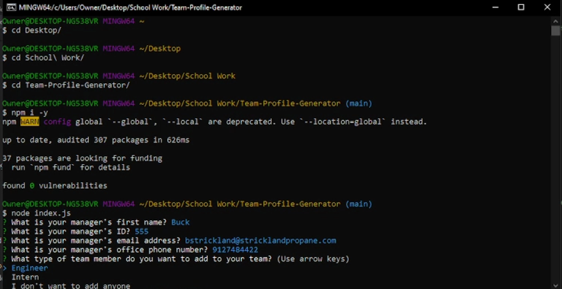
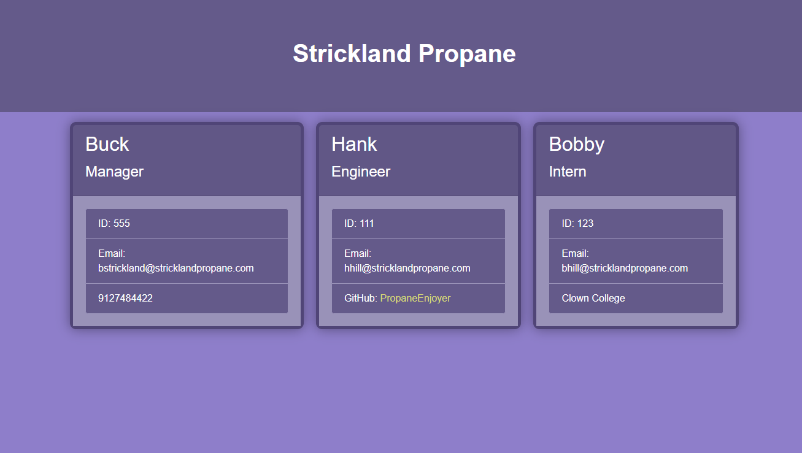

# Team-Profile-Generator
  

  ## Description

  This is a Team Profile generator using node.js! Simply answer the questions asked in the terminal and it will create an html page with your team members for you, no fuss, no muss!

  ## Table Of Contents

  - [Screenshots](#screenshots)
  - [Installation](#installation)
  - [Usage](#usage)
  - [License](#license)
  - [Guidelines](#guidelines)
  - [Questions](#questions)
  - [Tests](#tests)
  - [Video](#video)

  ## Screenshots

  ## Installation

  To install this generator, you need to do the following: Click on the green code button on this repo and copy the url provided in the HTTPS section, Open a terminal window and use the 'cd' command to change into your prefered folder to store the files of this generator, type 'git clone ' and paste the url you copied from the HTTPS section, Once the files have cloned onto your computer, use the 'cd' command to change into the directory you just cloned, it should be called Team-Profile-Generator, Type in 'npm i' to install required packages, and finally type in 'node index.js' to run the file, you will now be prompted with questions to answer

  ## Usage

  Answer the questions provided and a team profile html file is generated
  
## License
    This work is licensed under Creative Commons Attribution 3.0 Unported License.
    https://creativecommons.org/terms#8

  ## Guidelines

  You are open to do with this code as you wish

  ## Questions

  This repo was created by https://github.com/BenBasic
  To contact me, please send an email to Benjamin@TreneonGames.com

  ## Tests
  node index.js will run the program in a terminal window, then answer the questions as requested

  ## Video
https://www.youtube.com/watch?v=Z4hVSBu2mYI